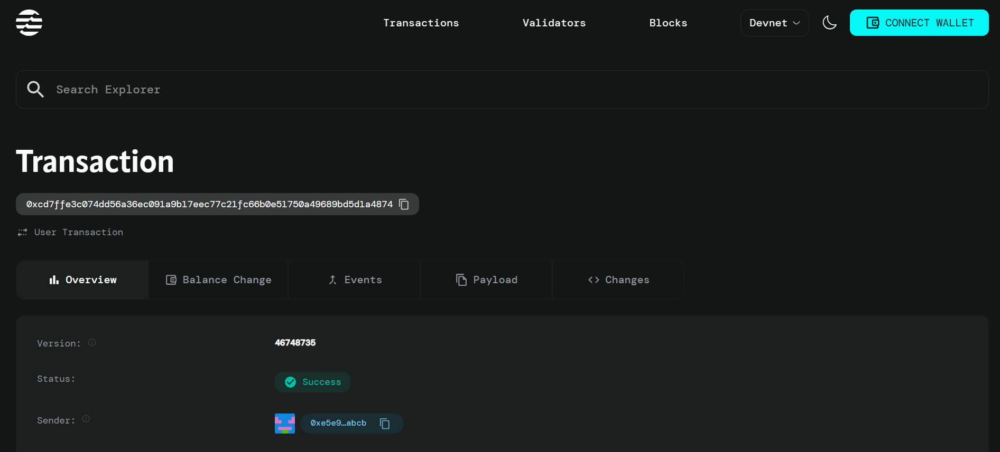

# Arbitrage Contract

## Project Description

The Arbitrage Contract is a Move smart contract built on the Aptos blockchain that enables automated detection and execution of arbitrage opportunities across different decentralized exchanges (DEXs) and price sources. The contract identifies price discrepancies between trading pairs and facilitates profitable trades by exploiting these temporary market inefficiencies.

## Project Vision

To democratize arbitrage trading by providing an automated, transparent, and efficient smart contract solution that allows users to capitalize on price differences across multiple decentralized finance (DeFi) platforms. Our vision is to create a seamless arbitrage ecosystem that maximizes profit opportunities while minimizing risks and manual intervention.

## Key Features

- **Automated Opportunity Detection**: Continuously monitors price differences between multiple sources to identify profitable arbitrage opportunities
- **Configurable Profit Thresholds**: Users can set minimum profit margins to ensure trades meet their profitability requirements
- **Real-time Execution**: Executes arbitrage trades automatically when profitable opportunities are detected
- **Timestamp Tracking**: Maintains accurate records of when opportunities were last updated and executed
- **Gas-efficient Operations**: Optimized smart contract design to minimize transaction costs
- **Risk Management**: Built-in checks to prevent unprofitable trades and ensure sufficient funds before execution

## Future Scope

- **Multi-DEX Integration**: Expand support for additional decentralized exchanges and automated market makers (AMMs)
- **Flash Loan Integration**: Implement flash loan functionality to execute larger arbitrage trades without requiring upfront capital
- **Advanced Price Feeds**: Integration with multiple oracle services for more accurate and reliable price data
- **MEV Protection**: Implement mechanisms to protect against Maximum Extractable Value (MEV) attacks
- **Yield Farming**: Add features to automatically compound arbitrage profits into yield farming strategies
- **Cross-chain Arbitrage**: Extend functionality to detect and execute arbitrage opportunities across different blockchain networks
- **Machine Learning Integration**: Implement AI-driven algorithms to predict and optimize arbitrage opportunities
- **Governance Token**: Introduce a governance mechanism for community-driven protocol improvements
- **Advanced Analytics Dashboard**: Develop comprehensive reporting and analytics tools for tracking arbitrage performance
- **Liquidity Pool Creation**: Enable users to create and manage their own arbitrage-focused liquidity pools

## Contract Details
0xcd7ffe3c074dd56a36ec091a9b17eec77c21fc66b0e51750a49689bd5d1a4874

